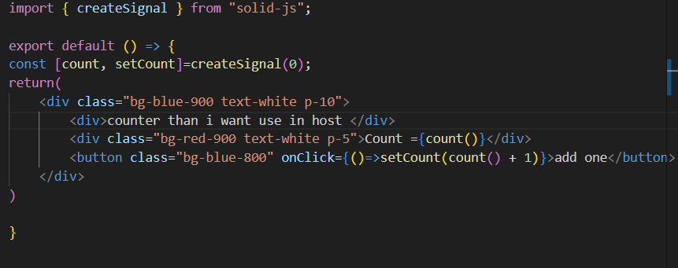

# Sans titre

Tutorial Micro frontend

Microfrontends are an architectural approach that breaks down a large frontend application into smaller, independent applications that work together seamlessly. Inspired by microservices, this approach allows different teams to develop, deploy, and maintain their own parts of the frontend independently.

How It Works

Each microfrontend is a self-contained application that can be built with different technologies (React, Vue, Angular, etc.). They communicate with each other using shared APIs or events. A Host application integrates multiple microfrontends dynamically, often using Module Federation in Webpack, iFrames, or server-side composition.

This approach improves scalability, enables independent deployments, and helps manage large codebases more efficiently.

start:

create project 

in your project create 2 frontend project with  the next commande (open 2 terminal for each project):

                                             **npx create-mf-app**

here i choose to name host and remote i put host in  port 8080 and remote in 3000

each microfront end need to have a different port  and for the other  option i choose react js and tailwind but it’s depends of the technology that you want use in your project.

after go in each of your microfrontend app in your 2 terminal 

in first terminal bash **cd host** 

in seconde bash **cd remote** 

in 2 terminal bash yarn for install depency of your project 

you can bash **yarn start** in your 2 terminal for see if your 2 project work 

in remote  you will do a fonction that you want use in your host to for example a counter function 

at the moment you can call this funtion in your app.ts of remote project for use it in this frontend 

the next objective it’s to exporte this function to remote  for use it in host apllication 

for that you need to go in webpack.config.js 
and in the line exposes writte what do you wnat expose for exemple here it’s your function count 
  **"./Counter" : "./src/Counter.jsx”**

after go in webpack.config.js in your host application 

and in line remotes 
writte **remote: "remote@[http://localhost:3000/remoteEntry.js](http://localhost:3000/remoteEntry.js)"**

it’s for map with the counter that you expose in remote application 

think to restart your 2 application host and remote with yarn start and now you can  importe your counter in your host application 
 **import Counter from “remote/Counter”;**

and use it in your application like you want 

here theire are at the left my host application where i want use counter and at the right remote application with counter also but the app of the 2 application is not the same theire are only the counter that is take in remote application and if you change it in remote application it will be change also for host application .